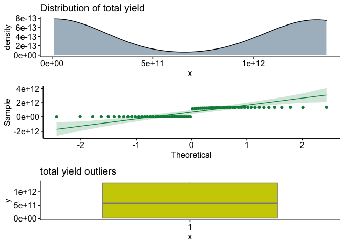
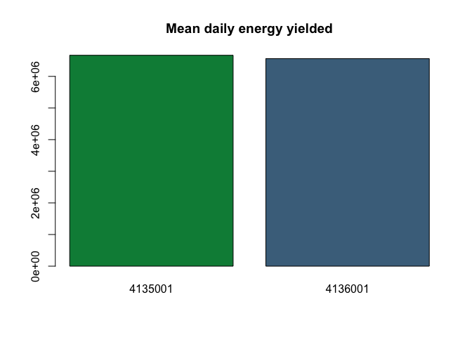
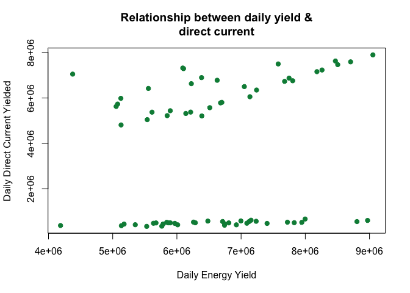

```r
knitr::opts_chunk$set(fig.path='Figs/')
```
### We are going to be looking at solar plant energy data. We will rely heavily on EDA for this analysis
### We have data from two plants with the same metrics being measured 

### Let's define the variables
#### DATE_TIME: Refers to the date_time in 15 minute intervals 
#### PLANT_ID: Refers to the specific plant ID- there are only two plants that have been sampled
#### SOURCE_KEY(generator): Refers to the inverter id 
#### SOURCE_KEY(sensor): Sensor panel id
#### AMBIENT_TEMPERATURE: Temperature at the plant
#### MODULE_TEMPERATURE: Temperature of the sensor
#### IRRADIATION: Amount of solar IRRADIATION in 15 minute intervals. Solar irradiation refers to the conversion of solar light to solar energy.
#### DC_POWER: Amount of direct current power generated in 15 minute intervals 
#### AC_POWER: Amount of alternating current power generated in 15 minute intervals
#### DAILY_YIELD: Cumulative sum of power generated at that point in the day
#### TOTAL_YIELD: Total yield for that inverter up until that point 

#### Let's start by importing relevant packages & reviewing the data


```r
library('ggplot2')
library('dplyr')
```

```
## 
## Attaching package: 'dplyr'
```

```
## The following objects are masked from 'package:stats':
## 
##     filter, lag
```

```
## The following objects are masked from 'package:base':
## 
##     intersect, setdiff, setequal, union
```

```r
library('olsrr')
```

```
## 
## Attaching package: 'olsrr'
```

```
## The following object is masked from 'package:datasets':
## 
##     rivers
```

```r
library('ggpubr')
library('gridExtra')
```

```
## 
## Attaching package: 'gridExtra'
```

```
## The following object is masked from 'package:dplyr':
## 
##     combine
```

#### Reading in the 4 seperate files 

```r
plant_g_1 <-  read.csv(file.path('/Users/jasminesamuel/Downloads/836676_1428586_bundle_archive/Plant_1_Generation_Data.csv'))
plant_g_2 <- read.csv(file.path('/Users/jasminesamuel/Downloads/836676_1428586_bundle_archive/Plant_2_Generation_Data.csv'))
plant_s_1 <- read.csv(file.path('/Users/jasminesamuel/Downloads/836676_1428586_bundle_archive/Plant_1_Weather_Sensor_Data.csv'))
plant_s_2 <- read.csv(file.path('/Users/jasminesamuel/Downloads/836676_1428586_bundle_archive/Plant_2_Weather_Sensor_Data.csv'))
```
### Looking at the data structure and getting familar with the data & variables


```r
str(plant_g_1) # solar plant generator data 
```

```
## 'data.frame':	68778 obs. of  7 variables:
##  $ DATE_TIME  : chr  "15-05-2020 00:00" "15-05-2020 00:00" "15-05-2020 00:00" "15-05-2020 00:00" ...
##  $ PLANT_ID   : int  4135001 4135001 4135001 4135001 4135001 4135001 4135001 4135001 4135001 4135001 ...
##  $ SOURCE_KEY : chr  "1BY6WEcLGh8j5v7" "1IF53ai7Xc0U56Y" "3PZuoBAID5Wc2HD" "7JYdWkrLSPkdwr4" ...
##  $ DC_POWER   : num  0 0 0 0 0 0 0 0 0 0 ...
##  $ AC_POWER   : num  0 0 0 0 0 0 0 0 0 0 ...
##  $ DAILY_YIELD: num  0 0 0 0 0 0 0 0 0 0 ...
##  $ TOTAL_YIELD: num  6259559 6183645 6987759 7602960 7158964 ...
```

```r
str(plant_g_2)
```

```
## 'data.frame':	67698 obs. of  7 variables:
##  $ DATE_TIME  : chr  "2020-05-15 00:00:00" "2020-05-15 00:00:00" "2020-05-15 00:00:00" "2020-05-15 00:00:00" ...
##  $ PLANT_ID   : int  4136001 4136001 4136001 4136001 4136001 4136001 4136001 4136001 4136001 4136001 ...
##  $ SOURCE_KEY : chr  "4UPUqMRk7TRMgml" "81aHJ1q11NBPMrL" "9kRcWv60rDACzjR" "Et9kgGMDl729KT4" ...
##  $ DC_POWER   : num  0 0 0 0 0 0 0 0 0 0 ...
##  $ AC_POWER   : num  0 0 0 0 0 0 0 0 0 0 ...
##  $ DAILY_YIELD: num  9425 0 3075 270 3177 ...
##  $ TOTAL_YIELD: num  2.43e+06 1.22e+09 2.25e+09 1.70e+06 1.99e+07 ...
```


```r
str(plant_s_1) # solar plant sensor data 
```

```
## 'data.frame':	3182 obs. of  6 variables:
##  $ DATE_TIME          : chr  "2020-05-15 00:00:00" "2020-05-15 00:15:00" "2020-05-15 00:30:00" "2020-05-15 00:45:00" ...
##  $ PLANT_ID           : int  4135001 4135001 4135001 4135001 4135001 4135001 4135001 4135001 4135001 4135001 ...
##  $ SOURCE_KEY         : chr  "HmiyD2TTLFNqkNe" "HmiyD2TTLFNqkNe" "HmiyD2TTLFNqkNe" "HmiyD2TTLFNqkNe" ...
##  $ AMBIENT_TEMPERATURE: num  25.2 25.1 24.9 24.8 24.6 ...
##  $ MODULE_TEMPERATURE : num  22.9 22.8 22.6 22.4 22.2 ...
##  $ IRRADIATION        : num  0 0 0 0 0 0 0 0 0 0 ...
```

```r
str(plant_s_2) # solar plant sensor data 
```

```
## 'data.frame':	3259 obs. of  6 variables:
##  $ DATE_TIME          : chr  "2020-05-15 00:00:00" "2020-05-15 00:15:00" "2020-05-15 00:30:00" "2020-05-15 00:45:00" ...
##  $ PLANT_ID           : int  4136001 4136001 4136001 4136001 4136001 4136001 4136001 4136001 4136001 4136001 ...
##  $ SOURCE_KEY         : chr  "iq8k7ZNt4Mwm3w0" "iq8k7ZNt4Mwm3w0" "iq8k7ZNt4Mwm3w0" "iq8k7ZNt4Mwm3w0" ...
##  $ AMBIENT_TEMPERATURE: num  27 26.9 26.7 26.5 26.6 ...
##  $ MODULE_TEMPERATURE : num  25.1 24.4 24.4 24.4 25.1 ...
##  $ IRRADIATION        : num  0 0 0 0 0 0 0 0 0 0 ...
```

```r
head(plant_g_1)
```

```
##          DATE_TIME PLANT_ID      SOURCE_KEY DC_POWER AC_POWER DAILY_YIELD
## 1 15-05-2020 00:00  4135001 1BY6WEcLGh8j5v7        0        0           0
## 2 15-05-2020 00:00  4135001 1IF53ai7Xc0U56Y        0        0           0
## 3 15-05-2020 00:00  4135001 3PZuoBAID5Wc2HD        0        0           0
## 4 15-05-2020 00:00  4135001 7JYdWkrLSPkdwr4        0        0           0
## 5 15-05-2020 00:00  4135001 McdE0feGgRqW7Ca        0        0           0
## 6 15-05-2020 00:00  4135001 VHMLBKoKgIrUVDU        0        0           0
##   TOTAL_YIELD
## 1     6259559
## 2     6183645
## 3     6987759
## 4     7602960
## 5     7158964
## 6     7206408
```

```r
head(plant_g_2)
```

```
##             DATE_TIME PLANT_ID      SOURCE_KEY DC_POWER AC_POWER DAILY_YIELD
## 1 2020-05-15 00:00:00  4136001 4UPUqMRk7TRMgml        0        0   9425.0000
## 2 2020-05-15 00:00:00  4136001 81aHJ1q11NBPMrL        0        0      0.0000
## 3 2020-05-15 00:00:00  4136001 9kRcWv60rDACzjR        0        0   3075.3333
## 4 2020-05-15 00:00:00  4136001 Et9kgGMDl729KT4        0        0    269.9333
## 5 2020-05-15 00:00:00  4136001 IQ2d7wF4YD8zU1Q        0        0   3177.0000
## 6 2020-05-15 00:00:00  4136001 LYwnQax7tkwH5Cb        0        0   1872.5000
##   TOTAL_YIELD
## 1     2429011
## 2  1215278736
## 3  2247719577
## 4     1704250
## 5    19941526
## 6  1794958634
```

```r
head(plant_s_1)
```

```
##             DATE_TIME PLANT_ID      SOURCE_KEY AMBIENT_TEMPERATURE
## 1 2020-05-15 00:00:00  4135001 HmiyD2TTLFNqkNe            25.18432
## 2 2020-05-15 00:15:00  4135001 HmiyD2TTLFNqkNe            25.08459
## 3 2020-05-15 00:30:00  4135001 HmiyD2TTLFNqkNe            24.93575
## 4 2020-05-15 00:45:00  4135001 HmiyD2TTLFNqkNe            24.84613
## 5 2020-05-15 01:00:00  4135001 HmiyD2TTLFNqkNe            24.62153
## 6 2020-05-15 01:15:00  4135001 HmiyD2TTLFNqkNe            24.53609
##   MODULE_TEMPERATURE IRRADIATION
## 1           22.85751           0
## 2           22.76167           0
## 3           22.59231           0
## 4           22.36085           0
## 5           22.16542           0
## 6           21.96857           0
```

```r
head(plant_s_2)
```

```
##             DATE_TIME PLANT_ID      SOURCE_KEY AMBIENT_TEMPERATURE
## 1 2020-05-15 00:00:00  4136001 iq8k7ZNt4Mwm3w0            27.00476
## 2 2020-05-15 00:15:00  4136001 iq8k7ZNt4Mwm3w0            26.88081
## 3 2020-05-15 00:30:00  4136001 iq8k7ZNt4Mwm3w0            26.68206
## 4 2020-05-15 00:45:00  4136001 iq8k7ZNt4Mwm3w0            26.50059
## 5 2020-05-15 01:00:00  4136001 iq8k7ZNt4Mwm3w0            26.59615
## 6 2020-05-15 01:15:00  4136001 iq8k7ZNt4Mwm3w0            26.51274
##   MODULE_TEMPERATURE IRRADIATION
## 1           25.06079           0
## 2           24.42187           0
## 3           24.42729           0
## 4           24.42068           0
## 5           25.08821           0
## 6           25.31797           0
```
#### Let's see if any null variables exist

```r
lapply(plant_g_1,function(x) { length(which(is.na(x)))})
```

```
## $DATE_TIME
## [1] 0
## 
## $PLANT_ID
## [1] 0
## 
## $SOURCE_KEY
## [1] 0
## 
## $DC_POWER
## [1] 0
## 
## $AC_POWER
## [1] 0
## 
## $DAILY_YIELD
## [1] 0
## 
## $TOTAL_YIELD
## [1] 0
```

```r
lapply(plant_g_2,function(x) { length(which(is.na(x)))})
```

```
## $DATE_TIME
## [1] 0
## 
## $PLANT_ID
## [1] 0
## 
## $SOURCE_KEY
## [1] 0
## 
## $DC_POWER
## [1] 0
## 
## $AC_POWER
## [1] 0
## 
## $DAILY_YIELD
## [1] 0
## 
## $TOTAL_YIELD
## [1] 0
```

```r
lapply(plant_s_1,function(x) { length(which(is.na(x)))})
```

```
## $DATE_TIME
## [1] 0
## 
## $PLANT_ID
## [1] 0
## 
## $SOURCE_KEY
## [1] 0
## 
## $AMBIENT_TEMPERATURE
## [1] 0
## 
## $MODULE_TEMPERATURE
## [1] 0
## 
## $IRRADIATION
## [1] 0
```

```r
lapply(plant_s_2,function(x) { length(which(is.na(x)))})
```

```
## $DATE_TIME
## [1] 0
## 
## $PLANT_ID
## [1] 0
## 
## $SOURCE_KEY
## [1] 0
## 
## $AMBIENT_TEMPERATURE
## [1] 0
## 
## $MODULE_TEMPERATURE
## [1] 0
## 
## $IRRADIATION
## [1] 0
```
#### Look's like we don't have any null values!


### Data Preprocessing
####  We have some changes to make to our data structure to make it more ideal for analysis.
####  -Right now we have 4 different data files, let's combine them into one file. 
#### -factor level data needs to be recoded 
#### -Clean up the time stamp data- data reported in 15 minute intervals 

#### PLANT_ID refers to the id of the plant. Let's change PLANT_ID from character to factor


```r
plant_g_1$PLANT_ID <- factor(plant_g_1$PLANT_ID)
plant_g_2$PLANT_ID <- factor(plant_g_2$PLANT_ID)
plant_s_1$PLANT_ID <- factor(plant_s_1$PLANT_ID)
plant_s_2$PLANT_ID <- factor(plant_s_2$PLANT_ID)
```
#### SOURCE_KEY have different values for sensor and generator id- we aren't going to be able to merge data on this factor and we can't use this variable as a factor to compare sensor vs generator data let's drop this and have plant_id as the main factor variable 


```r
plant_g_1$SOURCE_KEY <- NULL
plant_g_2$SOURCE_KEY <- NULL
plant_s_1$SOURCE_KEY <- NULL
plant_s_2$SOURCE_KEY <- NULL
```
#### DATE_TIME reported in 15 minute intervals. Lets just aggregate our observations by day 


```r
plant_g_1$DATE <- as.Date(plant_g_1$DATE_TIME, format= '%d-%m-%Y')
plant_g_1$DATE[1:10] 
```

```
##  [1] "2020-05-15" "2020-05-15" "2020-05-15" "2020-05-15" "2020-05-15"
##  [6] "2020-05-15" "2020-05-15" "2020-05-15" "2020-05-15" "2020-05-15"
```

```r
plant_g_1$DATE_TIME<- NULL# we can drop DATE_TIME
```


```r
plant_g_2$DATE <- as.Date(plant_g_2$DATE_TIME, format = '%Y-%m-%d')
plant_g_2$DATE[1:10]
```

```
##  [1] "2020-05-15" "2020-05-15" "2020-05-15" "2020-05-15" "2020-05-15"
##  [6] "2020-05-15" "2020-05-15" "2020-05-15" "2020-05-15" "2020-05-15"
```

```r
plant_g_2$DATE_TIME <- NULL 
```

```r
plant_s_1$DATE <- as.Date(plant_s_1$DATE_TIME , format = '%Y-%m-%d')
plant_s_1$DATE[1:10]
```

```
##  [1] "2020-05-15" "2020-05-15" "2020-05-15" "2020-05-15" "2020-05-15"
##  [6] "2020-05-15" "2020-05-15" "2020-05-15" "2020-05-15" "2020-05-15"
```

```r
plant_s_1$DATE_TIME <- NULL 
```


```r
plant_s_2$DATE <- as.Date(plant_s_2$DATE_TIME, format = '%Y-%m-%d')
plant_s_2$DATE[1:10]
```

```
##  [1] "2020-05-15" "2020-05-15" "2020-05-15" "2020-05-15" "2020-05-15"
##  [6] "2020-05-15" "2020-05-15" "2020-05-15" "2020-05-15" "2020-05-15"
```

```r
plant_s_2$DATE_TIME <- NULL
```
#### Now that we have dates cleaned we can aggregate data by day using dplyr package


```r
plant_g_1 <- plant_g_1 %>%
  group_by(DATE, PLANT_ID) %>%
  summarise_all(sum)
plant_g_1
```

```
## # A tibble: 34 x 6
## # Groups:   DATE [34]
##    DATE       PLANT_ID DC_POWER AC_POWER DAILY_YIELD  TOTAL_YIELD
##    <date>     <fct>       <dbl>    <dbl>       <dbl>        <dbl>
##  1 2020-05-15 4135001  5627239.  550831.    5053591. 13396793557.
##  2 2020-05-16 4135001  5806138.  568360.    6699905. 13273365620.
##  3 2020-05-17 4135001  6759595.  660975.    7804065. 14507767213.
##  4 2020-05-18 4135001  4812549.  470970.    5130290. 14520941632.
##  5 2020-05-19 4135001  5437955.  532250.    5896321. 13707398626.
##  6 2020-05-20 4135001  5375586.  525085.    5612536. 11517627080.
##  7 2020-05-21 4135001  6781068.  662742.    6627303.  9446312277.
##  8 2020-05-22 4135001  6420685.  627830.    5555931. 13989682404.
##  9 2020-05-23 4135001  7630217.  745884.    8468993. 13536007825.
## 10 2020-05-24 4135001  7160354.  699818.    8181251. 14617604912.
## # … with 24 more rows
```

```r
plant_g_2 <- plant_g_2 %>%
  group_by(DATE, PLANT_ID) %>%
  summarise_all(sum)
plant_g_2
```

```
## # A tibble: 34 x 6
## # Groups:   DATE [34]
##    DATE       PLANT_ID DC_POWER AC_POWER DAILY_YIELD TOTAL_YIELD
##    <date>     <fct>       <dbl>    <dbl>       <dbl>       <dbl>
##  1 2020-05-15 4136001   666608.  651438.    7997412.     1.35e12
##  2 2020-05-16 4136001   566840.  554253.    7234658.     1.35e12
##  3 2020-05-17 4136001   556237.  544393.    6712265.     1.36e12
##  4 2020-05-18 4136001   530774.  519013.    6259087.     1.36e12
##  5 2020-05-19 4136001   443496.  433555.    5177354.     1.31e12
##  6 2020-05-20 4136001   352374.  344661.    5764847.     1.15e12
##  7 2020-05-21 4136001   494112.  483021.    5674293.     1.26e12
##  8 2020-05-22 4136001   498711.  487412.    5897264.     1.27e12
##  9 2020-05-23 4136001   501823.  490451.    6287109.     1.26e12
## 10 2020-05-24 4136001   479294.  468609.    5635139.     1.24e12
## # … with 24 more rows
```

```r
plant_s_1 <- plant_s_1 %>%
  group_by(DATE,PLANT_ID) %>%
  summarise_all(sum)
plant_s_1
```

```
## # A tibble: 34 x 5
## # Groups:   DATE [34]
##    DATE       PLANT_ID AMBIENT_TEMPERATURE MODULE_TEMPERATURE IRRADIATION
##    <date>     <fct>                  <dbl>              <dbl>       <dbl>
##  1 2020-05-15 4135001                2551.              3030.        19.0
##  2 2020-05-16 4135001                2357.              2804.        18.7
##  3 2020-05-17 4135001                2562.              3143.        22.9
##  4 2020-05-18 4135001                2290.              2670.        15.3
##  5 2020-05-19 4135001                2356.              2764.        18.0
##  6 2020-05-20 4135001                2006.              2347.        18.2
##  7 2020-05-21 4135001                1886.              2529.        23.6
##  8 2020-05-22 4135001                2547.              3118.        22.1
##  9 2020-05-23 4135001                2416.              3132.        26.1
## 10 2020-05-24 4135001                2652.              3262.        24.9
## # … with 24 more rows
```

```r
plant_s_2 <- plant_s_2 %>%
  group_by(DATE, PLANT_ID) %>%
  summarise_all(sum)
plant_s_2
```

```
## # A tibble: 34 x 5
## # Groups:   DATE [34]
##    DATE       PLANT_ID AMBIENT_TEMPERATURE MODULE_TEMPERATURE IRRADIATION
##    <date>     <fct>                  <dbl>              <dbl>       <dbl>
##  1 2020-05-15 4136001                2904.              3378.        28.6
##  2 2020-05-16 4136001                2830.              3374.        23.7
##  3 2020-05-17 4136001                2859.              3324.        21.2
##  4 2020-05-18 4136001                2624.              3035.        21.5
##  5 2020-05-19 4136001                2518.              2860.        20.3
##  6 2020-05-20 4136001                2710.              3202.        26.8
##  7 2020-05-21 4136001                2789.              3339.        27.2
##  8 2020-05-22 4136001                2846.              3528.        28.5
##  9 2020-05-23 4136001                2942.              3543.        28.2
## 10 2020-05-24 4136001                2957.              3563.        27.4
## # … with 24 more rows
```
#### Now lets combine all the data into one dataframe 


```r
plant_generator <- union(plant_g_1,plant_g_2)
plant_sensor <- union(plant_s_1, plant_s_2)
plant_generator
```

```
## # A tibble: 68 x 6
## # Groups:   DATE [34]
##    DATE       PLANT_ID DC_POWER AC_POWER DAILY_YIELD  TOTAL_YIELD
##    <date>     <fct>       <dbl>    <dbl>       <dbl>        <dbl>
##  1 2020-05-15 4135001  5627239.  550831.    5053591. 13396793557.
##  2 2020-05-16 4135001  5806138.  568360.    6699905. 13273365620.
##  3 2020-05-17 4135001  6759595.  660975.    7804065. 14507767213.
##  4 2020-05-18 4135001  4812549.  470970.    5130290. 14520941632.
##  5 2020-05-19 4135001  5437955.  532250.    5896321. 13707398626.
##  6 2020-05-20 4135001  5375586.  525085.    5612536. 11517627080.
##  7 2020-05-21 4135001  6781068.  662742.    6627303.  9446312277.
##  8 2020-05-22 4135001  6420685.  627830.    5555931. 13989682404.
##  9 2020-05-23 4135001  7630217.  745884.    8468993. 13536007825.
## 10 2020-05-24 4135001  7160354.  699818.    8181251. 14617604912.
## # … with 58 more rows
```

```r
plant_sensor
```

```
## # A tibble: 68 x 5
## # Groups:   DATE [34]
##    DATE       PLANT_ID AMBIENT_TEMPERATURE MODULE_TEMPERATURE IRRADIATION
##    <date>     <fct>                  <dbl>              <dbl>       <dbl>
##  1 2020-05-15 4135001                2551.              3030.        19.0
##  2 2020-05-16 4135001                2357.              2804.        18.7
##  3 2020-05-17 4135001                2562.              3143.        22.9
##  4 2020-05-18 4135001                2290.              2670.        15.3
##  5 2020-05-19 4135001                2356.              2764.        18.0
##  6 2020-05-20 4135001                2006.              2347.        18.2
##  7 2020-05-21 4135001                1886.              2529.        23.6
##  8 2020-05-22 4135001                2547.              3118.        22.1
##  9 2020-05-23 4135001                2416.              3132.        26.1
## 10 2020-05-24 4135001                2652.              3262.        24.9
## # … with 58 more rows
```

```r
df <- merge(plant_generator,plant_sensor, by = c('PLANT_ID','DATE'))
```

### Data 
#### DATE_TIME(date time): Refers to the date_time in 15 minute intervals 
#### PLANT_ID(factor): Refers to the specific plant ID- there are only two plants that have been sampled
#### AMBIENT_TEMPERATURE(num): Temperature at the plant
#### MODULE_TEMPERATURE(num): Temperature of the sensor
#### IRRADIATION(num): Amount of solar IRRADIATION in 15 minute intervals. Solar irradiation refers to the conversion of solar light to solar energy.
#### DC_POWER(num): Amount of direct current power generated in 15 minute intervals 
#### AC_POWER(num): Amount of alternating current power generated in 15 minute intervals
#### DAILY_YIELD(num): Cumulative sum of power generated at that point in the day
#### TOTAL_YIELD(num): Total yield for that inverter up until that point 

#### Review the dataframe and it's structure 


```r
df
```

```
##    PLANT_ID       DATE  DC_POWER AC_POWER DAILY_YIELD  TOTAL_YIELD
## 1   4135001 2020-05-15 5627239.1 550831.0     5053591 1.339679e+10
## 2   4135001 2020-05-16 5806137.5 568359.8     6699905 1.327337e+10
## 3   4135001 2020-05-17 6759594.5 660975.4     7804065 1.450777e+10
## 4   4135001 2020-05-18 4812548.5 470969.7     5130290 1.452094e+10
## 5   4135001 2020-05-19 5437954.9 532250.5     5896321 1.370740e+10
## 6   4135001 2020-05-20 5375585.8 525084.6     5612536 1.151763e+10
## 7   4135001 2020-05-21 6781068.1 662742.4     6627303 9.446312e+09
## 8   4135001 2020-05-22 6420684.5 627830.1     5555931 1.398968e+10
## 9   4135001 2020-05-23 7630217.2 745884.3     8468993 1.353601e+10
## 10  4135001 2020-05-24 7160353.9 699817.8     8181251 1.461760e+10
## 11  4135001 2020-05-25 7898965.1 771576.2     9053215 1.427449e+10
## 12  4135001 2020-05-26 7052704.9 689483.8     4376113 1.437069e+10
## 13  4135001 2020-05-27 5985527.1 585707.9     5127007 1.424149e+10
## 14  4135001 2020-05-28 7501395.2 733119.5     7578132 1.376566e+10
## 15  4135001 2020-05-29 7295130.2 713110.6     6103425 1.036161e+10
## 16  4135001 2020-05-30 6502312.9 636043.2     7050152 1.471706e+10
## 17  4135001 2020-05-31 5378552.5 525939.2     6214020 1.469282e+10
## 18  4135001 2020-06-01 5210134.0 509691.5     6387988 1.474426e+10
## 19  4135001 2020-06-02 6631810.9 648667.6     6224743 1.459238e+10
## 20  4135001 2020-06-03 6732591.3 658508.4     7677981 1.464635e+10
## 21  4135001 2020-06-04 7321031.5 715775.2     6091402 1.435999e+10
## 22  4135001 2020-06-05 6898473.8 674574.2     6384127 1.458579e+10
## 23  4135001 2020-06-06 5730938.5 560332.5     5076817 1.439118e+10
## 24  4135001 2020-06-07 6876444.2 672139.5     7747108 1.483665e+10
## 25  4135001 2020-06-08 7470115.1 730087.5     8505252 1.485356e+10
## 26  4135001 2020-06-09 7234008.9 707237.5     8260297 1.487087e+10
## 27  4135001 2020-06-10 5784039.5 565937.5     6679794 1.488627e+10
## 28  4135001 2020-06-11 5045678.6 494174.9     5538094 1.489873e+10
## 29  4135001 2020-06-12 5222353.9 511289.7     5848817 1.491091e+10
## 30  4135001 2020-06-13 7593776.3 742032.7     8705923 1.492604e+10
## 31  4135001 2020-06-14 6350494.6 621509.3     7240643 1.494235e+10
## 32  4135001 2020-06-15 6055535.9 592483.9     7137433 1.495713e+10
## 33  4135001 2020-06-16 5572501.3 545506.7     6512585 1.497068e+10
## 34  4135001 2020-06-17 5317779.8 520383.5     6138883 1.467137e+10
## 35  4136001 2020-05-15  666607.6 651437.7     7997412 1.347430e+12
## 36  4136001 2020-05-16  566839.8 554253.5     7234658 1.346965e+12
## 37  4136001 2020-05-17  556236.9 544393.0     6712265 1.357864e+12
## 38  4136001 2020-05-18  530773.7 519012.6     6259087 1.361871e+12
## 39  4136001 2020-05-19  443495.8 433554.7     5177354 1.314653e+12
## 40  4136001 2020-05-20  352374.4 344661.4     5764847 1.146138e+12
## 41  4136001 2020-05-21  494112.3 483021.4     5674293 1.258768e+12
## 42  4136001 2020-05-22  498711.3 487411.9     5897264 1.274881e+12
## 43  4136001 2020-05-23  501823.3 490450.5     6287109 1.258321e+12
## 44  4136001 2020-05-24  479293.5 468609.4     5635139 1.236102e+12
## 45  4136001 2020-05-25  582787.3 569576.3     6996642 1.247754e+12
## 46  4136001 2020-05-26  576620.1 563483.2     6481991 1.219494e+12
## 47  4136001 2020-05-27  445436.7 435466.2     5784824 1.148820e+12
## 48  4136001 2020-05-28  499034.0 487742.9     5866414 1.256704e+12
## 49  4136001 2020-05-29  496059.2 485377.1     6808404 1.291878e+12
## 50  4136001 2020-05-30  614530.6 600856.5     7154658 1.353977e+12
## 51  4136001 2020-05-31  556847.6 544366.1     7125460 1.350929e+12
## 52  4136001 2020-06-01  372059.0 363681.3     5135112 1.339304e+12
## 53  4136001 2020-06-02  519492.0 508269.6     5840944 1.310165e+12
## 54  4136001 2020-06-03  414845.2 406045.1     5351371 1.333943e+12
## 55  4136001 2020-06-04  474970.4 464789.5     5967317 1.358949e+12
## 56  4136001 2020-06-05  518707.5 507337.9     7945888 1.362251e+12
## 57  4136001 2020-06-06  527117.1 515131.9     7721987 1.339788e+12
## 58  4136001 2020-06-07  473278.9 462528.8     7404470 1.328888e+12
## 59  4136001 2020-06-08  604333.9 590644.6     8970222 1.361305e+12
## 60  4136001 2020-06-09  554027.1 541913.6     8804847 1.355549e+12
## 61  4136001 2020-06-10  393589.8 385086.4     6741997 1.318146e+12
## 62  4136001 2020-06-11  342752.9 335847.8     5529623 1.339452e+12
## 63  4136001 2020-06-12  411233.9 402905.0     6011759 1.350843e+12
## 64  4136001 2020-06-13  455305.8 445507.8     6743320 1.325963e+12
## 65  4136001 2020-06-14  505911.5 495073.5     7827889 1.362168e+12
## 66  4136001 2020-06-15  410998.9 402322.1     6926075 1.362414e+12
## 67  4136001 2020-06-16  480810.1 470830.4     7089666 1.340767e+12
## 68  4136001 2020-06-17  380211.2 372436.3     4187174 1.346798e+12
##    AMBIENT_TEMPERATURE MODULE_TEMPERATURE IRRADIATION
## 1             2551.067           3030.216    19.03701
## 2             2356.687           2803.579    18.65169
## 3             2561.926           3143.082    22.93138
## 4             2289.690           2670.177    15.26649
## 5             2356.436           2764.440    18.04486
## 6             2006.143           2346.567    18.24554
## 7             1886.155           2528.707    23.55617
## 8             2546.563           3117.973    22.11912
## 9             2415.566           3132.166    26.10665
## 10            2652.011           3261.940    24.93718
## 11            2612.175           3315.260    27.23337
## 12            2582.828           3213.423    24.25059
## 13            2576.205           3112.348    20.53757
## 14            2569.563           3216.305    26.03238
## 15            2085.899           2868.066    24.79566
## 16            2399.157           2958.337    21.87505
## 17            2445.370           2895.428    17.62546
## 18            2378.833           2780.264    17.64924
## 19            2339.992           2827.022    21.48365
## 20            2355.589           2849.816    21.92771
## 21            2427.473           2997.276    24.67097
## 22            2387.580           2935.926    23.19266
## 23            2327.746           2765.066    19.52688
## 24            2401.545           3023.798    24.40237
## 25            2442.362           3035.705    25.31553
## 26            2452.391           3025.511    24.75467
## 27            2376.237           2803.444    19.23229
## 28            2342.727           2676.505    15.53371
## 29            2310.948           2648.240    16.30155
## 30            2358.406           2926.178    25.38935
## 31            2343.638           2824.484    21.12822
## 32            2383.432           2873.070    19.76881
## 33            2393.177           2837.334    17.97913
## 34            2326.054           2723.956    16.98851
## 35            2903.769           3378.152    28.55906
## 36            2829.947           3373.758    23.67657
## 37            2858.891           3324.166    21.23360
## 38            2624.323           3035.337    21.49578
## 39            2517.563           2860.078    20.34532
## 40            2710.370           3201.587    26.78687
## 41            2789.324           3339.149    27.19118
## 42            2846.262           3527.813    28.53584
## 43            2942.362           3543.355    28.15998
## 44            2957.371           3563.189    27.42604
## 45            2958.569           3510.436    26.55693
## 46            2882.687           3434.776    27.23467
## 47            2918.490           3555.311    27.43194
## 48            2892.485           3459.237    28.13703
## 49            2854.501           3313.966    23.23721
## 50            2836.672           3227.572    23.82700
## 51            2731.323           3177.390    19.20396
## 52            2423.169           2706.907    13.43026
## 53            2601.831           3156.786    23.74862
## 54            2482.750           2809.381    16.61464
## 55            2525.274           2959.750    20.18278
## 56            2599.906           3100.854    22.36660
## 57            2668.925           3153.679    25.96374
## 58            2674.153           3225.085    25.03494
## 59            2735.361           3293.972    27.03844
## 60            2700.185           3164.197    23.83802
## 61            2624.123           2959.345    18.57632
## 62            2450.007           2615.839    11.27796
## 63            2369.608           2603.222    13.10297
## 64            2507.226           2917.908    20.69017
## 65            2593.900           3032.624    22.03363
## 66            2549.529           2879.638    17.76505
## 67            2531.510           2840.630    15.84592
## 68            2385.809           2560.189    11.94076
```

```r
str(df)
```

```
## 'data.frame':	68 obs. of  9 variables:
##  $ PLANT_ID           : Factor w/ 2 levels "4135001","4136001": 1 1 1 1 1 1 1 1 1 1 ...
##  $ DATE               : Date, format: "2020-05-15" "2020-05-16" ...
##  $ DC_POWER           : num  5627239 5806138 6759595 4812549 5437955 ...
##  $ AC_POWER           : num  550831 568360 660975 470970 532250 ...
##  $ DAILY_YIELD        : num  5053591 6699905 7804065 5130290 5896321 ...
##  $ TOTAL_YIELD        : num  1.34e+10 1.33e+10 1.45e+10 1.45e+10 1.37e+10 ...
##  $ AMBIENT_TEMPERATURE: num  2551 2357 2562 2290 2356 ...
##  $ MODULE_TEMPERATURE : num  3030 2804 3143 2670 2764 ...
##  $ IRRADIATION        : num  19 18.7 22.9 15.3 18 ...
```

```r
head(df)
```

```
##   PLANT_ID       DATE DC_POWER AC_POWER DAILY_YIELD TOTAL_YIELD
## 1  4135001 2020-05-15  5627239 550831.0     5053591 13396793557
## 2  4135001 2020-05-16  5806138 568359.8     6699905 13273365620
## 3  4135001 2020-05-17  6759595 660975.4     7804065 14507767213
## 4  4135001 2020-05-18  4812549 470969.7     5130290 14520941632
## 5  4135001 2020-05-19  5437955 532250.5     5896321 13707398626
## 6  4135001 2020-05-20  5375586 525084.6     5612536 11517627080
##   AMBIENT_TEMPERATURE MODULE_TEMPERATURE IRRADIATION
## 1            2551.067           3030.216    19.03701
## 2            2356.687           2803.579    18.65169
## 3            2561.926           3143.082    22.93138
## 4            2289.690           2670.177    15.26649
## 5            2356.436           2764.440    18.04486
## 6            2006.143           2346.567    18.24554
```
#### Basic statistics 

```r
summary(df)
```

```
##     PLANT_ID       DATE               DC_POWER          AC_POWER     
##  4135001:34   Min.   :2020-05-15   Min.   : 342753   Min.   :335848  
##  4136001:34   1st Qu.:2020-05-23   1st Qu.: 498048   1st Qu.:484788  
##               Median :2020-05-31   Median :2739578   Median :543140  
##               Mean   :2020-05-31   Mean   :3429043   Mean   :551531  
##               3rd Qu.:2020-06-09   3rd Qu.:6441092   3rd Qu.:639199  
##               Max.   :2020-06-17   Max.   :7898965   Max.   :771576  
##   DAILY_YIELD       TOTAL_YIELD        AMBIENT_TEMPERATURE MODULE_TEMPERATURE
##  Min.   :4187174   Min.   :9.446e+09   Min.   :1886        Min.   :2347      
##  1st Qu.:5826914   1st Qu.:1.459e+10   1st Qu.:2382        1st Qu.:2826      
##  Median :6497288   Median :5.806e+11   Median :2528        Median :3025      
##  Mean   :6613936   Mean   :6.631e+11   Mean   :2540        Mean   :3026      
##  3rd Qu.:7281600   3rd Qu.:1.339e+12   3rd Qu.:2681        3rd Qu.:3218      
##  Max.   :9053215   Max.   :1.362e+12   Max.   :2959        Max.   :3563      
##   IRRADIATION   
##  Min.   :11.28  
##  1st Qu.:18.63  
##  Median :22.08  
##  Mean   :21.84  
##  3rd Qu.:25.11  
##  Max.   :28.56
```


### EDA:Visualize & Understand data
#### Let's start by look at distributions & outliers of all variables


```r
v1 <- ggdensity(df$DAILY_YIELD,fill = 'skyblue4', main = 'Distribution of daily yield')
v2 <- ggqqplot(df$DAILY_YIELD, col='springgreen4')
v3 <- ggboxplot(df$DAILY_YIELD, fill = 'yellow3', col= "snow4", main ='Daily yield outliers')
grid.arrange(v1, v2,v3, nrow=3)
```

<!-- -->


#### Daily yield approx normally distributed with some possibly extreme values & appears to be linear


```r
v4 <- ggdensity(df$AC_POWER, fill = 'skyblue4', main = 'Distribution of alternating current')
v5 <- ggqqplot(df$AC_POWER, col='springgreen4')
v6 <- ggboxplot(df$AC_POWER, fill = 'yellow3', col= "snow4", main ='Anlternating current outliers')
grid.arrange(v4,v5,v6, nrow=3)
```

<!-- -->

#### AC_POWER is approaching normality & appears to be linear


```r
v7 <- ggdensity(df$DC_POWER, fill = 'skyblue4', main = 'Distribution of direct current')
v8 <- ggqqplot(df$DC_POWER, col='springgreen4')
v9 <- ggboxplot(df$DC_POWER,  fill = 'yellow3', col= "snow4", main ='Direct current outliers')
grid.arrange(v7, v8, v9, nrow=3)
```

<!-- -->

#### DC_POWER appearing bimodal & possibly s curve


```r
v10 <- ggdensity(df$TOTAL_YIELD, fill = 'skyblue4', main = 'Distribution of total yield')
v11 <- ggqqplot(df$TOTAL_YIELD, col='springgreen4')
v12 <- ggboxplot(df$TOTAL_YIELD, fill = 'yellow3', col= "snow4", main ='total yield outliers')
grid.arrange(v10, v11, v12, nrow=3)
```

<!-- -->

#### TOTAL_YIELD appearing bimodel and possible s curve


```r
v13 <- ggdensity(df$AMBIENT_TEMPERATURE, fill = 'skyblue4', main = 'Distribution of ambient temperature')
v14 <- ggqqplot(df$AMBIENT_TEMPERATURE, col='springgreen4')
v15 <- ggboxplot(df$AMBIENT_TEMPERATURE, fill = 'yellow3', col= "snow4", main ='Ambient temperature outliers')
grid.arrange(v13, v14, v15, nrow=3)
```

<!-- -->


#### AMBIENT_TEMPERATURE is linear, could be approaching normal, not extreme outliers


```r
v16 <- ggdensity(df$MODULE_TEMPERATURE, fill = 'skyblue4', main = 'Distribution of module temperature')
v17 <- ggqqplot(df$MODULE_TEMPERATURE, col='springgreen4')
v18 <- ggboxplot(df$MODULE_TEMPERATURE, fill = 'yellow3', col= "snow4", main ='Module temperature outliers')
grid.arrange(v16,v17,v18, nrow=3)
```

<!-- -->

#### MODULE_TEMPERATURE linear, approaching normal 


```r
v19 <- ggdensity(df$IRRADIATION, fill = 'skyblue4', main = 'Distribution of irradiation')
v20 <- ggqqplot(df$IRRADIATION, col='springgreen4')
v21 <- ggboxplot(df$IRRADIATION, fill = 'yellow3', col= "snow4", main ='Irradiation outliers')
grid.arrange(v19, v20, v21, nrow=3)
```

<!-- -->


#### IRRADIATION linear


#### Looking at each variables distributions gives us a sense of what variables are normally distributed and linear- giving us a better sense of what kind of possible tests and questions we want to ask about our data 

#### Here are a few questions I have and plan to explore during this EDA
#### Which power plant performs better?
#### Are there significant differences between types of power?
#### How does irradiation relate to different energy 
#### Does a relationship between temp, irradiation, and energy exist?
#### Are there any relevant predictors of daily yield? 

keeping in mind that DC_power, and total_yielded_power have very non linear and normal distributions
I will use the below sections to address and answer all these questions as well as any new questions that arise 


### Q1:  Which power plant performs better?
####  Let's start by looking at the different power plants 


```r
boxplot(df$DAILY_YIELD~df$PLANT_ID, main= 'Plant 1 vs. Plant 2:Examining Outliers', xlab='plant id', ylab='daily yield',col= c('springgreen4','skyblue4'))
```

<!-- -->

#### What is the average daily yield per plant?


```r
dy_means <- aggregate(df$DAILY_YIELD, by=list(df$PLANT_ID), FUN = mean)
dy_means
```

```
##   Group.1       x
## 1 4135001 6667357
## 2 4136001 6560514
```

```r
barplot(dy_means$x, names.arg = dy_means$Group.1, col= c('springgreen4','skyblue4'))
title("Mean daily energy yielded")
```

<!-- -->


#### There does not appear to be a large difference between the daily energy yielded by plant. Let's run a test and see if there are mean differences 


```r
summary(aov(df$DAILY_YIELD~df$PLANT_ID))
```

```
##             Df    Sum Sq   Mean Sq F value Pr(>F)
## df$PLANT_ID  1 1.941e+11 1.941e+11    0.15    0.7
## Residuals   66 8.545e+13 1.295e+12
```

#### There is no significant difference between energy yielded between plants.
#### What about ac_power?


```r
ac_mean <- aggregate(df$AC_POWER, by= list(df$PLANT_ID), FUN = mean)
ac_mean
```

```
##   Group.1        x
## 1 4135001 622648.8
## 2 4136001 480412.5
```

```r
barplot(ac_mean$x, names.arg=ac_mean$Group.1,col= c('springgreen4','skyblue4'))
title("Mean daily alternating current energy yielded ")
```

<!-- -->


#### Each plant seems to yield a difference amount of alternating current energy 
#### Let's see if these differences are significant? 


```r
summary(aov(df$AC_POWER~df$PLANT_ID))
```

```
##             Df    Sum Sq   Mean Sq F value   Pr(>F)    
## df$PLANT_ID  1 3.439e+11 3.439e+11   52.04 6.74e-10 ***
## Residuals   66 4.362e+11 6.609e+09                     
## ---
## Signif. codes:  0 '***' 0.001 '**' 0.01 '*' 0.05 '.' 0.1 ' ' 1
```
#### As suspected the mean daily alternating current yielded significantly differs between each plant 
#### Let's explore DC_POWER 


```r
dc_mean <- aggregate(df$DC_POWER, by= list(df$PLANT_ID), FUN= mean)
dc_mean
```

```
##   Group.1         x
## 1 4135001 6366872.9
## 2 4136001  491212.6
```

```r
barplot(dc_mean$x, names.arg = dc_mean$Group.1,col= c('springgreen4','skyblue4'))
title("Mean daily direct current energy yielded ")
```

<!-- -->


#### Similar to AC_POWER, each plant seems to generate different amounts of direct current on a daily basis 
#### Let's run a t test to seem if the differences are significant 


```r
plant_1 <- df[df$PLANT_ID == 4135001,]
plant_2 <- df[df$PLANT_ID != 4135001,]
t.test(plant_1$DC_POWER,plant_2$DC_POWER)
```

```
## 
## 	Welch Two Sample t-test
## 
## data:  plant_1$DC_POWER and plant_2$DC_POWER
## t = 38.538, df = 33.51, p-value < 2.2e-16
## alternative hypothesis: true difference in means is not equal to 0
## 95 percent confidence interval:
##  5565646 6185675
## sample estimates:
## mean of x mean of y 
## 6366872.9  491212.6
```

#### We see significant differences between dc for each plant. Overall there is a difference between alternating & direct current production for each plant.However, we do not see  significant difference in how much power total power is yielded per day.

### Q2: Are there significant differences between types of power?
#### What about differences between AC & DC power regardless of power plant? 

```r
# Looks like a difference between means. 
t.test(df$AC_POWER,df$AC_POWER)
```

```
## 
## 	Welch Two Sample t-test
## 
## data:  df$AC_POWER and df$AC_POWER
## t = 0, df = 134, p-value = 1
## alternative hypothesis: true difference in means is not equal to 0
## 95 percent confidence interval:
##  -36600.73  36600.73
## sample estimates:
## mean of x mean of y 
##  551530.6  551530.6
```


#### We do not see a signifcant differences between alternating and direct current.
#### It looks like the differences are at the factor level or the plants. Plant 1 
#### to perform signifcantly better for producing direct and alternating current 


### Next let's investigate eraddation levels


#### what is the average eradation level? 


```r
mean(df$IRRADIATION)
```

```
## [1] 21.83796
```
#### What's the relationship of irradiation and time?

```r
plot(df$DATE,df$IRRADIATION, main = 'Daily Irradation Levels', xlab='Day',ylab='Irradation level', pch= 19, col='springgreen4')
```

<!-- -->

#### We don't see a clear relationship between time & irradation levels. 
#### It's possible a relationship exists over longer periods of time For example
#### month over month, but  a limitation of this data is sample is only 34 days.

### Q3: How does irradiation relate to different energy 


```r
plot(df$IRRADIATION,df$DAILY_YIELD, main= 'Relationship between daily
     yielded power & Irradation', xlab= 'Irradation', ylab = 'Daily yielded power',pch= 19, col='springgreen4')
```

<!-- -->


#### This relationship is moderately linear, with a few apparent outliers.


```r
plot(df$IRRADIATION,df$AC_POWER, main= 'Relationship between alternating 
current power & Irradation', xlab= 'Irradation', ylab = 'Alternating power current',pch= 19, col='springgreen4')
```

<!-- -->

#### We see a somewhat linear, possible curve relationship.


#### how does irradation relate to different types of temperature? 


```r
plot(df$IRRADIATION,df$AMBIENT_TEMPERATURE, main= 'Relationship between ambient
temperature and irradation', xlab= 'Irradiation', ylab = ' Ambient Temperature',
pch= 19, col='springgreen4')
```

<!-- -->

#### We see a slight curvlinear relationship, that may benefit in a transformation


```r
plot(df$IRRADIATION,df$MODULE_TEMPERATURE, main= 'Relationship between module
temperature and irradation', xlab= 'Irradiation', ylab = ' Module Temperature',
pch= 19, col='springgreen4')
```

<!-- -->


#### We also so a linear relationship between irradation and module temperature 

#### Let's look at other possible relationships between variables 


```r
plot(df$AMBIENT_TEMPERATURE,df$MODULE_TEMPERATURE, main= 'Relationship between module
temperature and ambient temperature', xlab= 'Ambient temperature', ylab = ' Module Temperature',
pch= 19, col='springgreen4')
```

<!-- -->
#### Unsurprisingly we see a strong linear relationship between temperature.


```r
plot(df$MODULE_TEMPERATURE,df$AC_POWER, main= 'Relationship between module
temperature and alternating current', xlab= 'Ambient temperature', ylab = 'Alternating current',
pch= 19, col='springgreen4')
```

<!-- -->

```r
plot(df$MODULE_TEMPERATURE,df$DAILY_YIELD, main= 'Relationship between module
temperature and daily yield', xlab= 'Ambient temperature', ylab = 'Daily yield',
pch= 19, col='springgreen4')
```

<!-- -->
#### We see a pretty similar relationship for energy yields and ambient temperature


```r
plot(df$AMBIENT_TEMPERATURE,df$MODULE_TEMPERATURE, main= 'Relationship between module
temperature and ambient temperature', xlab= 'Ambient temperature', ylab = ' Module Temperature',
pch= 19, col='springgreen4')
```

<!-- -->
#### Let's look at the correlation between variables 


```r
df_cor<- cor(df[,unlist(lapply(df, is.numeric))])
library(corrplot)
```

```
## corrplot 0.84 loaded
```

```r
col<- colorRampPalette(c('yellow3','springgreen4','skyblue4'))(20)
corrplot(df_cor, method= 'square', type='upper', col=col,tl.col="snow4", tl.srt=45)
```

<!-- -->

#### let's define a highly correlated variable at  r=.70+
#### dvs: ac_power, daily_yield, ambient_temp and module_temp correlates? 
#### ac power & daily yield are moderately correlated r=.52
#### ac power & module & ambient temp have low correlations r< .30
#### module * ambient temp are highly correlated r = .89

### Q4:Does a relationship between temp, irradiation, and energy exist?
#### Through our EDA we saw irradiation has a linear relationship with a few variables. Can we use temp and energy yielded to predict irradation levels?


### To deal with multicorrelates we will search procedures- step forward to help identify the best model


#### Let's start with building a multiple linear regression model with all the variables 
#### we investigated with irradiation

```r
irridation <- lm(IRRADIATION ~AC_POWER+MODULE_TEMPERATURE+DAILY_YIELD+AMBIENT_TEMPERATURE, data=df)
irridation
```

```
## 
## Call:
## lm(formula = IRRADIATION ~ AC_POWER + MODULE_TEMPERATURE + DAILY_YIELD + 
##     AMBIENT_TEMPERATURE, data = df)
## 
## Coefficients:
##         (Intercept)             AC_POWER   MODULE_TEMPERATURE  
##          -1.099e+01           -1.181e-06            2.575e-02  
##         DAILY_YIELD  AMBIENT_TEMPERATURE  
##           4.989e-07           -1.879e-02
```

```r
summary(irridation)
```

```
## 
## Call:
## lm(formula = IRRADIATION ~ AC_POWER + MODULE_TEMPERATURE + DAILY_YIELD + 
##     AMBIENT_TEMPERATURE, data = df)
## 
## Residuals:
##     Min      1Q  Median      3Q     Max 
## -3.2124 -1.1311 -0.1914  0.8213  4.3281 
## 
## Coefficients:
##                       Estimate Std. Error t value Pr(>|t|)    
## (Intercept)         -1.099e+01  3.030e+00  -3.627 0.000576 ***
## AC_POWER            -1.181e-06  3.401e-06  -0.347 0.729500    
## MODULE_TEMPERATURE   2.575e-02  2.591e-03   9.938 1.59e-14 ***
## DAILY_YIELD          4.989e-07  2.218e-07   2.249 0.027990 *  
## AMBIENT_TEMPERATURE -1.879e-02  3.280e-03  -5.730 3.04e-07 ***
## ---
## Signif. codes:  0 '***' 0.001 '**' 0.01 '*' 0.05 '.' 0.1 ' ' 1
## 
## Residual standard error: 1.656 on 63 degrees of freedom
## Multiple R-squared:  0.8632,	Adjusted R-squared:  0.8545 
## F-statistic: 99.41 on 4 and 63 DF,  p-value: < 2.2e-16
```

#### The model is significant p <.01 overall and yields R-squared of 85%, and a relatively lower residual standard error.
#### y = -1.099  -1.181(ac_power)  + 2.575(module_temperature) + 4.989(daily_yield) - 1.879(ambient_temperature)
#### Further investigation of the model that daily yield ,module & ambient temperature are significant 
#### predictors. 

#### Let's use search procedures to find the best version of this model. 
#### using the olsrr package we can explore different search procedures
#### we'll emplore step forward for ease


```r
ols_step_forward_p(irridation)
```

```
## 
##                                  Selection Summary                                   
## ------------------------------------------------------------------------------------
##         Variable                             Adj.                                       
## Step          Entered          R-Square    R-Square     C(p)        AIC        RMSE     
## ------------------------------------------------------------------------------------
##    1    MODULE_TEMPERATURE       0.6567      0.6515    94.1169    324.9532    2.5631    
##    2    AMBIENT_TEMPERATURE      0.8507      0.8461     6.7895    270.3579    1.7036    
##    3    DAILY_YIELD              0.8630      0.8565     3.1206    266.5097    1.6446    
## ------------------------------------------------------------------------------------
```

#### Using step forward procedures we see that the best predictors of irridation are module temperature, ambient temperature and daily yielded energy. 

#### A few things to consider while looking at the selection summary R squared refers to the amount of variability that can be attributed to the predictor(irridation). We have decent r squared= with daily yiled & ambient temp


```r
irridation_best <- lm(IRRADIATION~MODULE_TEMPERATURE+AMBIENT_TEMPERATURE+DAILY_YIELD, data=df)
irridation_best
```

```
## 
## Call:
## lm(formula = IRRADIATION ~ MODULE_TEMPERATURE + AMBIENT_TEMPERATURE + 
##     DAILY_YIELD, data = df)
## 
## Coefficients:
##         (Intercept)   MODULE_TEMPERATURE  AMBIENT_TEMPERATURE  
##          -1.161e+01            2.510e-02           -1.792e-02  
##         DAILY_YIELD  
##           4.615e-07
```

```r
summary(irridation_best)
```

```
## 
## Call:
## lm(formula = IRRADIATION ~ MODULE_TEMPERATURE + AMBIENT_TEMPERATURE + 
##     DAILY_YIELD, data = df)
## 
## Residuals:
##     Min      1Q  Median      3Q     Max 
## -3.2513 -1.0743 -0.1376  0.8855  4.3400 
## 
## Coefficients:
##                       Estimate Std. Error t value Pr(>|t|)    
## (Intercept)         -1.161e+01  2.422e+00  -4.795 1.01e-05 ***
## MODULE_TEMPERATURE   2.510e-02  1.760e-03  14.257  < 2e-16 ***
## AMBIENT_TEMPERATURE -1.792e-02  2.106e-03  -8.510 4.08e-12 ***
## DAILY_YIELD          4.615e-07  1.925e-07   2.397   0.0194 *  
## ---
## Signif. codes:  0 '***' 0.001 '**' 0.01 '*' 0.05 '.' 0.1 ' ' 1
## 
## Residual standard error: 1.645 on 64 degrees of freedom
## Multiple R-squared:  0.863,	Adjusted R-squared:  0.8565 
## F-statistic: 134.3 on 3 and 64 DF,  p-value: < 2.2e-16
```

#### We see that daily_yield, module temp and ambient temp are the best predictors of irridation levels
#### y = -1.161 + 2.51(module_temperature) + 4.615(daily_yield) - 1.79(ambient_temperature)

#### Let's investigate assumptions of this linear regression and this model by looking at residuals 


```r
plot(irridation_best)
```

<!-- --><!-- --><!-- --><!-- -->


#### Looking at the residual vs fitted plot will help us understand if our model is appropriate for glm. 

#### The residuals are random around the 0 line suggesting that the relationship is reasonably linear. 
#### The residuals roughly form a horizontal band around the 0 line, suggesting that the variances of the error terms are equal.
#### We do see some residuals that stand out- suggesting that outliers do exist.

#### Looking at the QQ plot we see that the model roughly fits a straight line 

#### Scale location plots indicate spread of points across the predicted values range. 
#### Ideally there should be a horizontal line, indicating homoscedasticity.
#### This model is homoscedastic, meaning it has an uniform variance and it becomes heteroscedastic around 23

#### Residuals vs. leverage 
#### We aren't seeing any points that fall within cook's distance, which suggest 
#### there are not observations that have high leverage or are potientially influencing 
#### our model 


#### Overall this model meets the assumptions of linear regression! 


### Q5: Are there any relevant predictors of daily yield? 

#### Next see if we can predict total energy from the type energy types 
#### Let's examine the relationship between energy & Alternating current

```r
plot(df$DAILY_YIELD,df$AC_POWER, main= 'Relationship between daily yield &
alternating current', xlab= 'Daily Energy Yield', ylab= 'Daily Alternating Current Yielded', 
pch= 19, col='springgreen4')
```

<!-- -->


#### There is weak linear relationship, perhaps treating outliers will give us a better relationship 


```r
plot(df$DAILY_YIELD, df$DC_POWER, main= 'Relationship between daily yield &
direct current', xlab= 'Daily Energy Yield', ylab= 'Daily Direct Current Yielded' ,
pch= 19, col='springgreen4' )
```

<!-- -->


#### There appears to be a linear relationship with a large amount of outliers 

#### we may not be able to use direct current as a linear predictor of daily yield, but we can still look at AC_POWER


```r
energy <- lm(df$DAILY_YIELD~df$AC_POWER)
energy 
```

```
## 
## Call:
## lm(formula = df$DAILY_YIELD ~ df$AC_POWER)
## 
## Coefficients:
## (Intercept)  df$AC_POWER  
##   3.593e+06    5.478e+00
```

```r
summary(energy)
```

```
## 
## Call:
## lm(formula = df$DAILY_YIELD ~ df$AC_POWER)
## 
## Residuals:
##      Min       1Q   Median       3Q      Max 
## -2993490  -549610    -9637   631893  2243591 
## 
## Coefficients:
##              Estimate Std. Error t value Pr(>|t|)    
## (Intercept) 3.593e+06  6.177e+05   5.816 1.92e-07 ***
## df$AC_POWER 5.478e+00  1.099e+00   4.982 4.80e-06 ***
## ---
## Signif. codes:  0 '***' 0.001 '**' 0.01 '*' 0.05 '.' 0.1 ' ' 1
## 
## Residual standard error: 971100 on 66 degrees of freedom
## Multiple R-squared:  0.2733,	Adjusted R-squared:  0.2623 
## F-statistic: 24.82 on 1 and 66 DF,  p-value: 4.797e-06
```
#### Overall the model is insignificant, has a low R squared, and an extremely high residual standard error suggesting this model is not a great fit for linear regression. 


### Summary 

Overall the data yielded some interesting findings as we explored the data. We were able to address these questions 

1.  Which power plant performs better?
Power plant 1(4135001) performs better on average than plant 2(4136001). We did find a significant difference in how much direct current and the alternating current was yielded on a daily basis per plant. However, there is no evidence to support that there was a significant difference between plants for overall energy yielded.

2. Are there significant differences between types of power?
There were no significant differences in how much alternating vs. direct current is created on average. 

3. How does irradiation relate to different energy 
We see a positive linear relationship between irradiation levels and alternating current. This suggests that higher irradiation levels yield higher alternating current power produced. However, we did not see much of a relationship between direct current and irradiation. 

4. Does a relationship between temp, irradiation, and energy exist?
We were able to find that irradiation levels can be predicted by different variables such as temperature, and total energy yielded. This is an interesting finding because irradiation is the conversion of solar light to solar energy. More irradiance allows us to convert and yield more energy. We can use this model to better understand how much irradiation we need to yield a certain amount of energy and identify the best conditions for the conversion of solar to solar energy. If we have target energy yield goals we can use this model to identify what irradiation conditions are needed to meet those goals.


5. Are there any relevant predictors of daily yield? 
Unfortunately, we were not able to find any significant predictors of daily yield. We did see a slight positive relationship between alternating current and daily yield, which suggests that higher alternating current output results in higher energy yielded overall. 

Limitations
We have a limited amount of observations (34 days), and we would except changes to things like the overall distributions to become more normalized as well as identify long term trends such as how seasons impact energy produced. Additionally other
geospatial data would be interesting to incorporate. 


